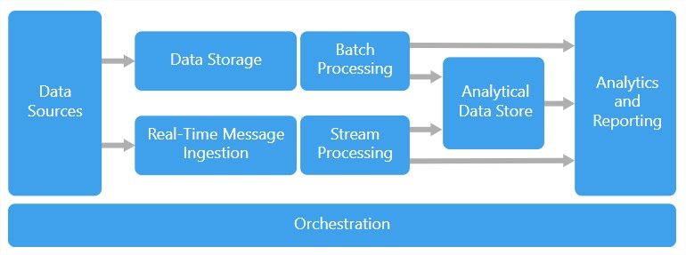
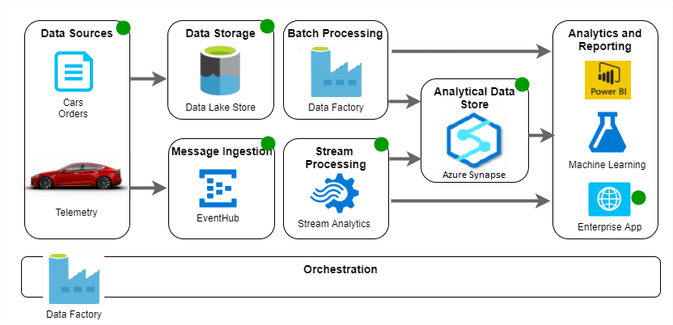
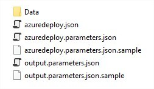
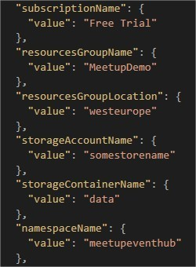
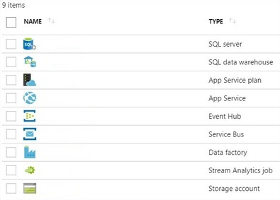
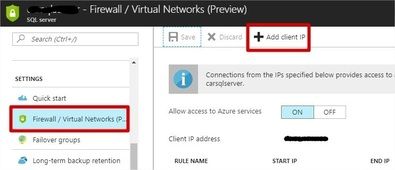
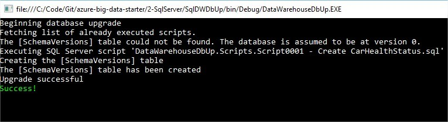
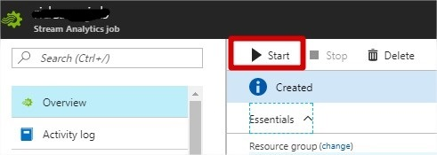
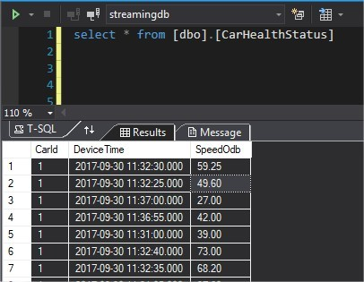
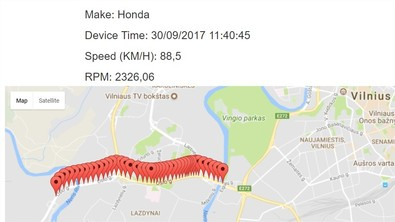

# Getting Started

This project aims to simplify Azure Big Data environment setup. Involved Azure PaaS services require different development and deployment steps, and this initiative is a set of suggestions for improving the overall development experience. We use car telemetry data as an example. 

You can find more information about Azure Big Data architectural style over [here.](https://docs.microsoft.com/en-us/azure/architecture/guide/architecture-styles/big-data)



Azure offers many different PaaS services for stream and batch workloads. Green dots mark currently utilized services. 





### Structure

* 0-Deployment - *PowerShell scripts*
* 1-Resources - *ARM templates and csv telemetry data files*
* 2-SqlServer - *Incremental database updates for Azure SQL Data Warehouse*
* 3-DataLakeAnalytics - *Empty*
* 4-DataFactory - *Empty*
* 5-MachineLearning - *Empty*
* 6-StreamAnalytics  - *WIP. Currently Stream Analytics objects are located in 1-Resources*
* 7-WebApp - *SignalR + Google Map dashboard*
* 8-EventApps - *Sending telemetry data to Event Hubs*

### Prerequisites
* [Azure Subscription](https://azure.microsoft.com/en-us/free/)
* [Visual Studio Code](https://code.visualstudio.com/)
* [Azure PowerShell 2](https://docs.microsoft.com/en-us/powershell/azure/overview?view=azurermps-4.4.0)

### Data

**1-Resources\Data\ride.csv**

This is a 25-minutes ride information (1 row per 1 second), including such details as lat, long, speed, rpm, throttle, fuel consumption, etc.  

| CarId | Device Time				| Longitude | Latitude	| SpeedOdb	| HP power	| ...	|
| ---	|-------------------------- | --------- | ---------	| --------- | --------- | ----- |
| 1		| 13-Sep-2014 10:20:39.466	| 25,23510	| 54,6698	| 80		| 150		| ...	|
| 1		| 13-Sep-2014 10:20:40.566	| 25,23710	| 54,7098	| 82		| 120		| ...	|
| 1		| 13-Sep-2014 10:20:41.356	| 25,24500	| 54,7292	| 83		| 100		| ...	|

**1-Resources\Data\car_info.csv**

Ride.csv file contains telemetry events and only car id. Car_info.csv file is a slowly changing data for enrichment - vehicle make and type. 

| CarId | Make		| Type	|
| ---	|-----------| ----- |
| 1		| Honda		| Civic |
| 2		| Lada      | Niva	|
| 3		| Porsche	| 911	|

### Objectives
1. Create all resouces using Azure ARM and fetch required keys 
2. Ingress car events using Azure Event Hub
3. Transform, enrich and aggregate events using Azure Stream Analytics
4. Visualize current vehicle location in a custom web app
5. Load aggregated events into Azure SQL Data Warehouse

---

# Deployment

**1** Find **.sample* config files (5), make a copy without **.sample* extension ([dealing with passwords in GitHub](https://stackoverflow.com/questions/2397822/what-is-the-best-practice-for-dealing-with-passwords-in-github)). 





**2** Populate *1-Resources/azuredeploy.parameters.json* with your values (use lower letters for names and be creative since some services require globally unique names).





**3** Run *0-Deployment\0-Initial.ps1* 
- Creates Azure Resources
- Populates local config files afterward
- Uploads reference data for data enrichment





**4** Add your IP to Azure SQL Server firewall.





**5** Deploy database objects by running *2-SqlServer\SqlDWDbUp* project.



 

---

# Execution

**1** Start Azure Stream Analytics (may take a few minutes, wait until status changes into Running)





**2** Run locally *7-WebApp\DashboardWebApp* to open a dashboard (refresh multiple times if Google map is not visible).


**3** Run locally *8-EventApps\CarEventsSenderApp* to send events to event hub.


**4** [Connect to SQL Data Warehouse](https://docs.microsoft.com/en-us/azure/sql-data-warehouse/sql-data-warehouse-query-visual-studio) and query *dbo.CarHealthStatus*





Azure Stream Analytics query that sends data to SQL Data Warehouse:

```sql
--Map into 10-second tumbling windows and send to SQL Warehouse

SELECT 
	Input.carid, 
	System.Timestamp as deviceTime,
	AVG(Input.SpeedOdb) as speedOdb
INTO SqlOutput 
FROM EventHubInput AS Input
GROUP BY Input.carid, TumblingWindow(SECOND, 10);
```

**5** Monitor dashboard web app





Azure Stream Analytics query that sends data to Service Bus and eventually to the web app:

```sql
--Join data with reference blob file and map into 5-second tumbling windows.

SELECT
    Ref.Make,
    System.Timestamp as deviceTime,
    AVG(Input.Longitude) as longitude,
    AVG(Input.Latitude) as latitude,
    AVG(Input.EngineRpm) as engineRpm,
    AVG(Input.SpeedOdb) as speedOdb
INTO ServiceBusOutput 
FROM EventHubInput AS Input
INNER JOIN [ReferenceInput] AS Ref
ON Input.carid = Ref.carid
GROUP BY Ref.Make, TumblingWindow(SECOND, 5);
```


---

# Limitations
* Globally unique names are required for some services (in case of deployment failure due to already occupied name, change the name and execute the deployment script again).
* Stream Analytics projects cannot be under folders in a solution, due to some issues with the VS component. Due to this limitation Stream Analytics hangs at the root level.
* ARM template for Stream Analytics doesn't support Data Lake store and PowerBI as outputs. 
* Data Lake Store and required Azure AD App.
* Columnstore in Azure SQL Datawarehouse doesn't like small inserts and transient data 
 
---

# To Do
* Replace batch processing with Synapse Analytics
* Add orchestration using Azure Data Factory
* Deploy Dashboard web app to Azure (Issues with app.config).
* Azure ASA deployment optimization and autostart
* Add an anomaly detection experiment using Azure Machine Learning

---

# Links
* [Azure Big Data Architectural Style](https://docs.microsoft.com/en-us/azure/architecture/guide/architecture-styles/big-data)
* [Azure Stream Analytics](https://docs.microsoft.com/en-us/azure/stream-analytics/stream-analytics-introduction)
* [Azure Data Warehouse](https://docs.microsoft.com/en-us/azure/sql-data-warehouse/)
* [Azure ARM deployment and templates](https://docs.microsoft.com/en-us/azure/azure-resource-manager/resource-group-overview)